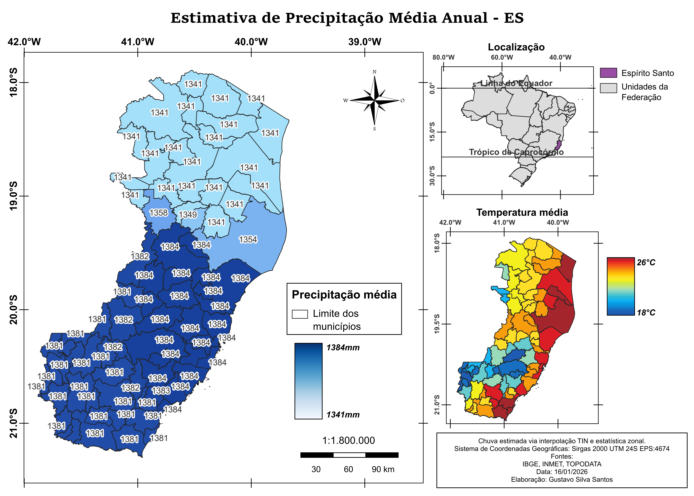
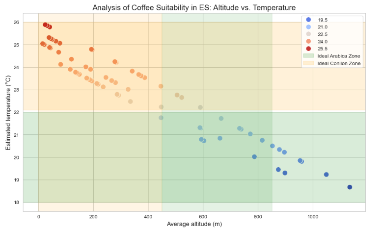
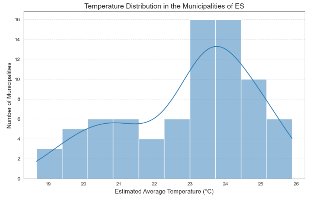

# Geospatial Climate Analysis & Agricultural Suitability (Espírito Santo, Brazil) 🌍☕

## 💡 Motivation & Background
The state of Espírito Santo possesses a unique topographical diversity that directly influences its agricultural potential, especially for coffee production. This project was born from the desire to understand how altitude dictates temperature patterns across our municipalities. By combining data science with geospatial intelligence, I aimed to create a tool that not only maps the current climate but also simulates future scenarios, providing insights for sustainable agriculture and regional planning.

## 📝 Project Overview
This project focuses on modeling climate variables across the state of Espírito Santo, Brazil. By integrating meteorological data with high-resolution elevation models, I developed a spatial analysis to estimate annual mean temperatures and identify suitable regions for Arabica and Conilon coffee production.

The study uses the **Adiabatic Lapse Rate** to correlate altitude and temperature, providing a detailed map of thermal environments in a state with complex topography.

---

## 🛠️ Tech Stack & Tools
* **Language:** Python (Pandas, Matplotlib, Seaborn, SQLAlchemy)
* **Database:** PostgreSQL with **PostGIS** extension
* **GIS Software:** QGIS (Map design and raster processing)
* **Data Source:** INMET, IBGE, and TOPODATA (INPE)

---

## 📂 Data Acquisition & Sources
Due to file size limitations, raw geospatial datasets (Rasters and GeoPackages) are not hosted in this repository. You can access the official data used in this project through the following links:

* **Digital Elevation Model (Raster):** Obtained from the [TOPODATA Project (INPE)](https://www.google.com/maps/d/viewer?mid=1Yle0c2VU4waXo-Kzn0RBONZG9NgSYas&ll=-20.425761794368373%2C-39.04870630643583&z=6).
* **Administrative Boundaries (Vector):** Municipal and State borders sourced from the [IBGE](https://www.ibge.gov.br/geociencias/cartografia/malhas-territoriais/).
* **Historical Climate Data:** Meteorological normals sourced from [INMET](https://portal.inmet.gov.br/).
* **Cartographic Support:** Reference lines (Equator and Tropics) provided by [Natural Earth](https://www.naturalearthdata.com/).
* **Technical Parameters:** Coffee suitability guidelines based on **Incaper/Embrapa** research.

The repository includes processed tabular data from INMET and reference vector lines from Natural Earth for immediate use. High-resolution Rasters and large GeoPackages are excluded due to size limits but can be sourced via the links below.

---

### Data Dictionary | Dicionário de Dados | Table: "municipios_es"

| Attribute (Atributo) | Description (PT-BR) | Description (EN) |
| :--- | :--- | :--- |
| `NM_MUN` | Nome do Município | Municipality Name |
| `NM_RGI` | Nome da Microrregião | Microrregion Name |
| `alt_mean` | Altitude Média (m) | Average Altitude (m) |
| `alt_min` | Altitude Mínima (m) | Minimum Altitude (m) |
| `alt_max` | Altitude máxima (m) | Maximum Altitude (m) |
| `precipitacao_mean` | Precipitação Média (mm) | Precipitation Mean (mm) |
| `tmax_anual` | Temperatura Máxima Anual (°C) | Annual Maximum Temperature (°C) |
| `tmin_anual` | Temperatura Mínima Anual (°C) | Annual Minimum Temperature (°C) |
| `aptidao` | Classificação de Aptidão Agrícola | Agricultural Suitability Classification |
| `est_ref` | Estação Meteorológica de Referência | Reference Weather Station |

### Table: "estacao_referencia"

| Attribute (Atributo) | Description (PT-BR) | Description (EN) |
| :--- | :--- | :--- |
| `nome_estacao` | Nome da Estação | Station Name |
| `altitude_ref` | Altitude de Referência (m) | Reference Altitude (m) |
| `temp_ref` | Temperatura de Referência (°C) | Reference Temperature (°C) |
| `data_ref` | Data de referência | Reference Date |
| `fonte_ref` | Fonte | Source |
| `precipitacao_ref` | Precipitação de Referência (mm) | Reference Precipitation (mm) |
| `geom` | Geometria | Geometry |

### View: "v_estimativa_climatica_es"

| Attribute (Atributo) | Description (PT-BR) | Description (EN) |
| :--- | :--- | :--- |
| `temperatura_base` | Temperatura Base (°C) | Base Temperature (°C) |
| `altitude_base` | Altitude Base (m) | Base Altitude (m) |
| `temperatura_estimada_celsius` | Temperatura Estimada (°C) | Estimated Temperature (°C) |
| `chuva_estimada_mm` | Precipitação Estimada (mm) | Estimated Precipitation (mm) |

---

## 📊 Analysis & Visualizations

### 🗺️ Spatial Modeling (QGIS)
Below are the generated maps showing the climatic patterns of Espírito Santo based on altitude gradients:

| Annual Mean Temperature | Annual Precipitation |
|:---:|:---:|
|  |  |

### 📈 Business Insights
The data processed in PostGIS allowed us to categorize the state's territory for agricultural planning:



*Figure 1: Distribution of municipalities by coffee variety suitability.*



*Figure 2: Frequency of municipalities within specific temperature ranges.*

---

## 🚀 How to Reproduce
To run this project locally, follow these steps:

1.  **Database Setup:** Execute the scripts in the `/sql` folder in your PostGIS instance:
    * `ddl.sql`: Creates the tables and spatial schema.
    * `dml.sql`: Handles data ingestion.
    * `querys.sql`: Business insights and climate simulations.
2.  **Environment:** Install the required Python libraries:
    ```bash
    pip install -r requirements.txt
    ```
3.  **Notebook Execution:** Open `notebooks/climate_es.ipynb`.
4.  **Secure Connection:** The notebook uses `getpass` for secure database authentication. When prompted, enter your local PostgreSQL credentials.

---

## 📊 Key Insights
* **Temperature Modeling:** Identified a strong negative correlation between altitude and temperature ($R^2$ analysis included in the notebook).
* **Agricultural Zoning:** Mapped specific zones where the temperature ($18°C$ to $22°C$) and altitude ($> 450m$) favor high-quality Arabica coffee.
* **Climate Change Simulation:** A query-based simulation of a $2°C$ global temperature increase shows a significant reduction in "cold-climate" municipalities in the state.

---

### 🤝 Let's Connect! / Vamos nos conectar!

If you are interested in **Geospatial Data Science**, **AgTech**, or **Smart Cities**, feel free to reach out!
Se você tem interesse em **Ciência de Dados Geoespaciais**, **AgTech** ou **Cidades Inteligentes**, sinta-se à vontade para se conectar!

- [LinkedIn](www.linkedin.com/in/gustavo-silva-89170b384)
- [Medium Artigo](https://medium.com/@g.silva0/title-where-to-plant-coffee-0edc94a03aef)
---
**Developed by Gustavo Silva Santos** *Geospatial Data Science & Climate Analysis*
